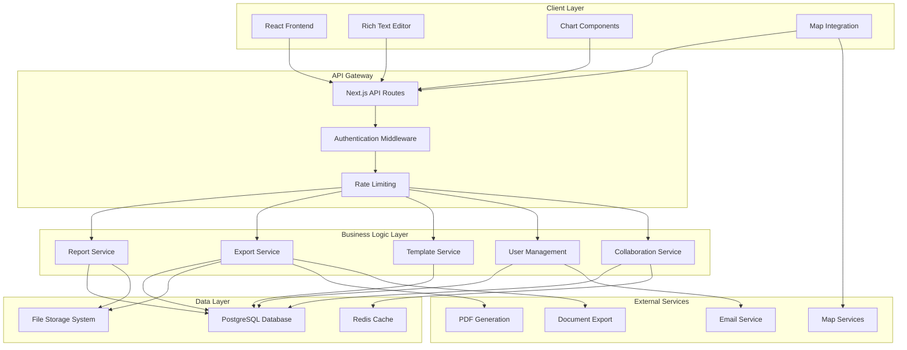

# Design Document

## Overview

The Humanitarian Report Management System is designed as a modern, scalable web application built on a Next.js foundation with a PostgreSQL database backend. The system follows a modular architecture that separates concerns between the presentation layer, business logic, and data persistence. The design emphasizes real-time collaboration, multi-format export capabilities, and robust security features while maintaining high performance and availability.

The architecture leverages React's component-based approach for the frontend, Express.js for API services, and PostgreSQL for reliable data storage. The system is designed to handle complex humanitarian reports with rich media content, collaborative editing, and sophisticated export functionality across multiple formats.

## Architecture

### High-Level Architecture



### Technology Stack

**Frontend:**
- Next.js 15 with App Router for server-side rendering and routing
- React 18 with TypeScript for type safety and component development
- Tailwind CSS with shadcn/ui components for consistent styling
- TinyMCE or Tiptap for rich text editing capabilities
- Recharts for data visualization and chart generation
- Leaflet for geographic mapping and location services
- React Query for efficient data fetching and caching

**Backend:**
- Node.js with Express.js for API development
- PostgreSQL 17 for primary data storage with JSON support
- Redis for session management and real-time collaboration
- JWT tokens for authentication and authorization
- Multer for file upload handling
- Socket.io for real-time collaborative features

**Export Engine:**
- Puppeteer for high-quality PDF generation
- docxtemplater for Word document creation
- ExcelJS for Excel file generation
- Handlebars for template processing

**Infrastructure:**
- Vercel for deployment and hosting
- Vercel Blob for file storage
- GitHub Actions for CI/CD pipeline
- Monitoring and logging services

## Components and Interfaces

### Core Components

#### 1. Report Editor Component
```typescript
interface ReportEditorProps {
  reportId: string;
  initialContent: ReportContent;
  isCollaborative: boolean;
  onSave: (content: ReportContent) => Promise<void>;
  onExport: (format: ExportFormat) => Promise<void>;
}

interface ReportContent {
  sections: ReportSection[];
  metadata: ReportMetadata;
  settings: ReportSettings;
}

interface ReportSection {
  id: string;
  type: 'text' | 'data_table' | 'chart' | 'image' | 'map';
  title: string;
  content: any;
  order: number;
  settings: SectionSettings;
}
```

#### 2. Export Service Interface
```typescript
interface ExportService {
  generatePDF(reportId: string, options: PDFOptions): Promise<Buffer>;
  generateWord(reportId: string, options: WordOptions): Promise<Buffer>;
  generateExcel(reportId: string, options: ExcelOptions): Promise<Buffer>;
  generateHTML(reportId: string, options: HTMLOptions): Promise<string>;
  batchExport(reportIds: string[], formats: ExportFormat[]): Promise<ExportResult[]>;
}

interface ExportOptions {
  includeImages: boolean;
  customBranding: BrandingOptions;
  pageLayout: PageLayout;
  watermark?: WatermarkOptions;
}
```

#### 3. Collaboration Service Interface
```typescript
interface CollaborationService {
  joinSession(reportId: string, userId: string): Promise<CollaborationSession>;
  broadcastChange(sessionId: string, change: ContentChange): void;
  resolveConflict(conflictId: string, resolution: ConflictResolution): Promise<void>;
  getActiveUsers(reportId: string): Promise<ActiveUser[]>;
}

interface ContentChange {
  type: 'insert' | 'delete' | 'update';
  sectionId: string;
  position: number;
  content: any;
  timestamp: Date;
  userId: string;
}
```

#### 4. Template Management Interface
```typescript
interface TemplateService {
  createTemplate(template: TemplateDefinition): Promise<Template>;
  getTemplates(organizationId: string): Promise<Template[]>;
  applyTemplate(reportId: string, templateId: string): Promise<void>;
  validateTemplate(template: TemplateDefinition): Promise<ValidationResult>;
}

interface TemplateDefinition {
  name: string;
  description: string;
  category: string;
  structure: SectionTemplate[];
  styling: StyleDefinition;
  isPublic: boolean;
}
```

### API Endpoints

#### Report Management
- `GET /api/reports` - List reports with filtering and pagination
- `POST /api/reports` - Create new report
- `GET /api/reports/:id` - Get specific report
- `PUT /api/reports/:id` - Update report content
- `DELETE /api/reports/:id` - Delete report
- `POST /api/reports/:id/duplicate` - Duplicate existing report

#### Export Operations
- `POST /api/reports/:id/export/pdf` - Generate PDF export
- `POST /api/reports/:id/export/word` - Generate Word document
- `POST /api/reports/:id/export/excel` - Generate Excel file
- `POST /api/reports/:id/export/html` - Generate HTML export
- `POST /api/reports/batch-export` - Batch export multiple reports

#### Collaboration
- `GET /api/reports/:id/collaborators` - Get active collaborators
- `POST /api/reports/:id/join` - Join collaboration session
- `WebSocket /api/reports/:id/collaborate` - Real-time collaboration

#### Template Management
- `GET /api/templates` - List available templates
- `POST /api/templates` - Create new template
- `GET /api/templates/:id` - Get template details
- `PUT /api/templates/:id` - Update template
- `POST /api/templates/:id/apply` - Apply template to report

## Data Models

### Database Schema

#### Reports Table
```sql
CREATE TABLE reports (
    id UUID PRIMARY KEY DEFAULT gen_random_uuid(),
    title VARCHAR(255) NOT NULL,
    type VARCHAR(50) NOT NULL CHECK (type IN ('assessment', 'situation', 'evaluation')),
    status VARCHAR(20) NOT NULL DEFAULT 'draft' CHECK (status IN ('draft', 'review', 'published')),
    created_date TIMESTAMP WITH TIME ZONE DEFAULT NOW(),
    last_modified TIMESTAMP WITH TIME ZONE DEFAULT NOW(),
    author_id UUID NOT NULL REFERENCES users(id),
    organization_id UUID NOT NULL REFERENCES organizations(id),
    template_id UUID REFERENCES templates(id),
    metadata JSONB DEFAULT '{}',
    content_sections JSONB DEFAULT '[]',
    version INTEGER DEFAULT 1,
    parent_version_id UUID REFERENCES reports(id)
);

CREATE INDEX idx_reports_organization ON reports(organization_id);
CREATE INDEX idx_reports_author ON reports(author_id);
CREATE INDEX idx_reports_status ON reports(status);
CREATE INDEX idx_reports_type ON reports(type);
CREATE INDEX idx_reports_modified ON reports(last_modified);
```

#### Sections Table
```sql
CREATE TABLE sections (
    id UUID PRIMARY KEY DEFAULT gen_random_uuid(),
    report_id UUID NOT NULL REFERENCES reports(id) ON DELETE CASCADE,
    title VARCHAR(255) NOT NULL,
    section_order INTEGER NOT NULL,
    section_type VARCHAR(50) NOT NULL CHECK (section_type IN ('text', 'data_table', 'chart', 'image', 'map')),
    content JSONB NOT NULL DEFAULT '{}',
    settings JSONB DEFAULT '{}',
    created_date TIMESTAMP WITH TIME ZONE DEFAULT NOW(),
    last_modified TIMESTAMP WITH TIME ZONE DEFAULT NOW()
);

CREATE INDEX idx_sections_report ON sections(report_id);
CREATE INDEX idx_sections_order ON sections(report_id, section_order);
```

#### Templates Table
```sql
CREATE TABLE templates (
    id UUID PRIMARY KEY DEFAULT gen_random_uuid(),
    name VARCHAR(255) NOT NULL,
    description TEXT,
    category VARCHAR(100),
    structure JSONB NOT NULL,
    styling JSONB DEFAULT '{}',
    is_public BOOLEAN DEFAULT FALSE,
    organization_id UUID REFERENCES organizations(id),
    created_by UUID NOT NULL REFERENCES users(id),
    created_date TIMESTAMP WITH TIME ZONE DEFAULT NOW(),
    usage_count INTEGER DEFAULT 0
);

CREATE INDEX idx_templates_organization ON templates(organization_id);
CREATE INDEX idx_templates_public ON templates(is_public);
CREATE INDEX idx_templates_category ON templates(category);
```

#### Organizations Table
```sql
CREATE TABLE organizations (
    id UUID PRIMARY KEY DEFAULT gen_random_uuid(),
    name VARCHAR(255) NOT NULL,
    logo_url VARCHAR(500),
    branding JSONB DEFAULT '{}',
    settings JSONB DEFAULT '{}',
    created_date TIMESTAMP WITH TIME ZONE DEFAULT NOW(),
    subscription_tier VARCHAR(50) DEFAULT 'basic'
);
```

#### Users Table
```sql
CREATE TABLE users (
    id UUID PRIMARY KEY DEFAULT gen_random_uuid(),
    email VARCHAR(255) UNIQUE NOT NULL,
    name VARCHAR(255) NOT NULL,
    password_hash VARCHAR(255) NOT NULL,
    role VARCHAR(20) NOT NULL DEFAULT 'editor' CHECK (role IN ('admin', 'editor', 'viewer')),
    organization_id UUID NOT NULL REFERENCES organizations(id),
    permissions JSONB DEFAULT '{}',
    last_login TIMESTAMP WITH TIME ZONE,
    created_date TIMESTAMP WITH TIME ZONE DEFAULT NOW(),
    is_active BOOLEAN DEFAULT TRUE,
    mfa_enabled BOOLEAN DEFAULT FALSE,
    mfa_secret VARCHAR(255)
);

CREATE INDEX idx_users_organization ON users(organization_id);
CREATE INDEX idx_users_email ON users(email);
CREATE INDEX idx_users_role ON users(role);
```

#### Assessment Data Tables
```sql
CREATE TABLE assessments (
    id UUID PRIMARY KEY DEFAULT gen_random_uuid(),
    report_id UUID NOT NULL REFERENCES reports(id) ON DELETE CASCADE,
    location JSONB, -- GeoJSON format
    date_range JSONB NOT NULL, -- {start_date, end_date}
    methodology JSONB DEFAULT '{}',
    team_members JSONB DEFAULT '[]',
    created_date TIMESTAMP WITH TIME ZONE DEFAULT NOW()
);

CREATE TABLE findings (
    id UUID PRIMARY KEY DEFAULT gen_random_uuid(),
    assessment_id UUID NOT NULL REFERENCES assessments(id) ON DELETE CASCADE,
    sector VARCHAR(50) NOT NULL CHECK (sector IN ('protection', 'shelter', 'health', 'wash', 'education')),
    priority VARCHAR(10) NOT NULL CHECK (priority IN ('high', 'medium', 'low')),
    description TEXT NOT NULL,
    evidence JSONB DEFAULT '[]',
    affected_population JSONB DEFAULT '{}',
    created_date TIMESTAMP WITH TIME ZONE DEFAULT NOW()
);

CREATE TABLE displacement_data (
    id UUID PRIMARY KEY DEFAULT gen_random_uuid(),
    assessment_id UUID NOT NULL REFERENCES assessments(id) ON DELETE CASCADE,
    province VARCHAR(100) NOT NULL,
    households INTEGER NOT NULL DEFAULT 0,
    individuals INTEGER NOT NULL DEFAULT 0,
    demographics JSONB DEFAULT '{}',
    location_type VARCHAR(50) CHECK (location_type IN ('camp', 'host_family', 'other')),
    date_recorded TIMESTAMP WITH TIME ZONE DEFAULT NOW()
);
```

### File Storage Structure
```
/uploads/
  /{organization_id}/
    /reports/
      /{report_id}/
        /images/
        /documents/
        /exports/
    /templates/
    /media-library/
```

## Error Handling

### Error Classification
1. **Validation Errors** (400): Invalid input data, missing required fields
2. **Authentication Errors** (401): Invalid credentials, expired tokens
3. **Authorization Errors** (403): Insufficient permissions, resource access denied
4. **Not Found Errors** (404): Resource doesn't exist
5. **Conflict Errors** (409): Version conflicts, concurrent editing issues
6. **Server Errors** (500): Database failures, external service errors
7. **Export Errors** (422): Template processing failures, format conversion issues

### Error Response Format
```typescript
interface ErrorResponse {
  error: {
    code: string;
    message: string;
    details?: any;
    timestamp: string;
    requestId: string;
  };
}
```

### Error Handling Strategies
- **Graceful Degradation**: Continue operation with reduced functionality when non-critical services fail
- **Retry Logic**: Automatic retry for transient failures with exponential backoff
- **Circuit Breaker**: Prevent cascading failures by temporarily disabling failing services
- **Fallback Mechanisms**: Alternative approaches when primary methods fail
- **User-Friendly Messages**: Convert technical errors to actionable user guidance

### Specific Error Scenarios
- **Export Failures**: Retry with different engines, provide partial exports
- **Collaboration Conflicts**: Automatic merge for compatible changes, manual resolution for conflicts
- **File Upload Issues**: Virus scan failures, size limit exceeded, format validation
- **Database Connectivity**: Connection pooling, read replicas for degraded performance
- **Authentication Failures**: Clear guidance for password reset, MFA setup

## Testing Strategy

### Testing Pyramid

#### Unit Tests (70% coverage target)
- **Component Testing**: React components with React Testing Library
- **Service Layer Testing**: Business logic and data transformations
- **Utility Functions**: Helper functions and data validators
- **API Endpoint Testing**: Individual route handlers and middleware

#### Integration Tests (20% coverage target)
- **Database Integration**: Repository pattern implementations
- **External Service Integration**: Export engines, email services
- **API Integration**: End-to-end API workflows
- **Authentication Flow**: Login, registration, permission checks

#### End-to-End Tests (10% coverage target)
- **Critical User Journeys**: Report creation, editing, and export
- **Collaboration Workflows**: Multi-user editing scenarios
- **Cross-Browser Testing**: Chrome, Firefox, Safari, Edge
- **Mobile Responsiveness**: Touch interactions, responsive layouts

### Testing Tools and Frameworks
- **Frontend**: Jest, React Testing Library, Cypress
- **Backend**: Jest, Supertest, Testcontainers for database testing
- **Performance**: Lighthouse CI, k6 for load testing
- **Security**: OWASP ZAP, Snyk for vulnerability scanning

### Test Data Management
- **Fixtures**: Standardized test data sets for consistent testing
- **Database Seeding**: Automated test data generation
- **Mock Services**: External service mocking for isolated testing
- **Test Isolation**: Each test runs with clean state

### Continuous Testing
- **Pre-commit Hooks**: Run unit tests and linting before commits
- **Pull Request Validation**: Full test suite execution
- **Deployment Testing**: Smoke tests in staging environment
- **Production Monitoring**: Synthetic transaction monitoring

### Performance Testing
- **Load Testing**: 1000+ concurrent users simulation
- **Stress Testing**: System behavior under extreme load
- **Export Performance**: Large report generation timing
- **Database Performance**: Query optimization validation